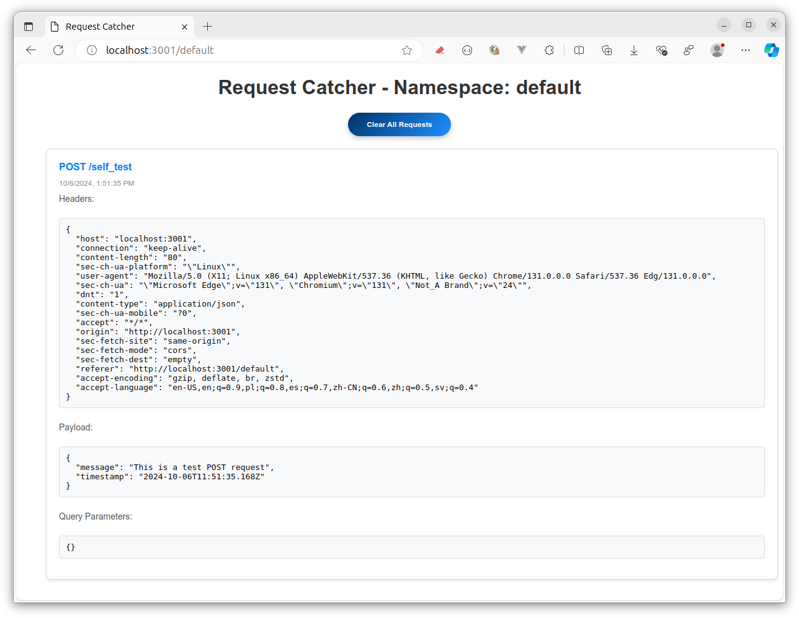

# Simple request catcher

### How to run

* after clone run
* `npm install`
* `node app.js`

or
* docker run run -d -p 3100:3100 $(docker build -q .)

### Call examples

#### GET request with query params

curl http://localhost:3100/default/data?name=John&age=30

#### POST request with JSON body

curl -X POST http://localhost:3100/default/data -H "Content-Type: application/json" -d '{"name":"John", "age":30}'

#### PUT request with URL params

curl -X PUT http://localhost:3100/default/data/123 -H "Content-Type: application/json" -d '{"status":"updated"}'

#### DELETE request

curl -X DELETE http://localhost:3100/default/data/123

